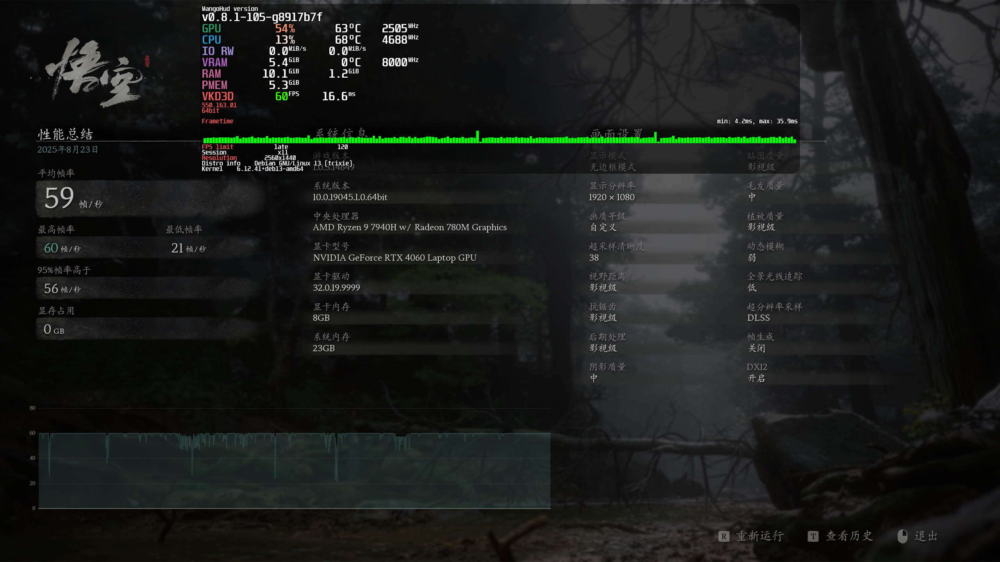
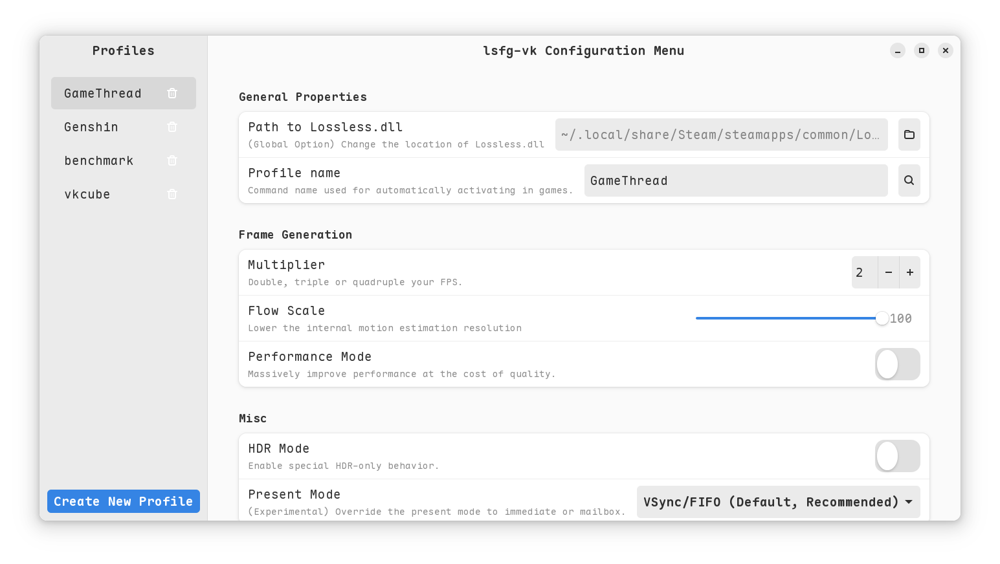

# my_helix_editor_config

> 参考 [Helix 配置](https://docs.helix-editor.com/configuration.html)

适合我的 Helix Editor 配置文件。

---

## 链接

- [给Helix编辑器配置Rust、Python的LSP服务，实现代码提示补全、格式化、高亮等功能 ](https://www.bilibili.com/read/cv25583084/)

---

## 我在使用 [Debian](https://www.debian.org/)

### 游戏

#### [MangoHud](https://github.com/flightlessmango/MangoHud)

apt 里的 mangohud 版本较低，不能监控 NVIDIA GPU，去 GitHub clone 源码编译即可。版本为 v0.8.1-105-g8917b7f。

```
# steam启动黑神话：悟空
mangohud VK_ICD_FILENAMES=/usr/share/vulkan/icd.d/nvidia_icd.json PROTON_ENABLE_NVAPI=1 LSFG_PROCESS="GameThread" %command%
## PROTON_NO_ESYNC=1
## $ truncate -s 0 ~/.steam/steam/logs/console-linux.txt  # https://github.com/PancakeTAS/lsfg-vk/wiki/How-to-ask-for-help
## VK_INSTANCE_LAYERS=VK_LAYER_KHRONOS_validation VK_LOADER_DEBUG=all

```

【【用Linux玩黑神话：悟空】演示华硕天选4畅玩黑猴！】 https://www.bilibili.com/video/BV1rfeEzsEwW/?share_source=copy_web&vd_source=19217e47f7df9bfa5b5735a12f378008




#### [lsfg-vk](https://github.com/PancakeTAS/lsfg-vk)


